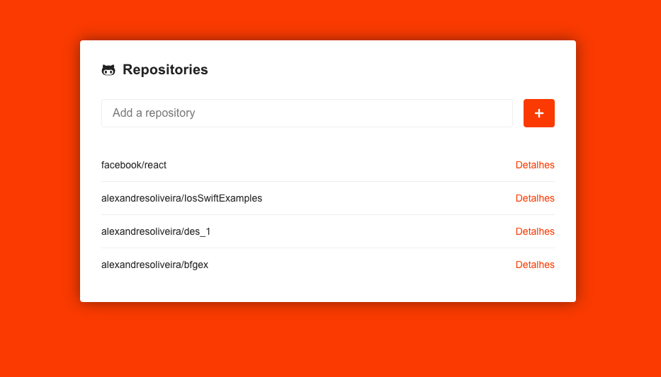
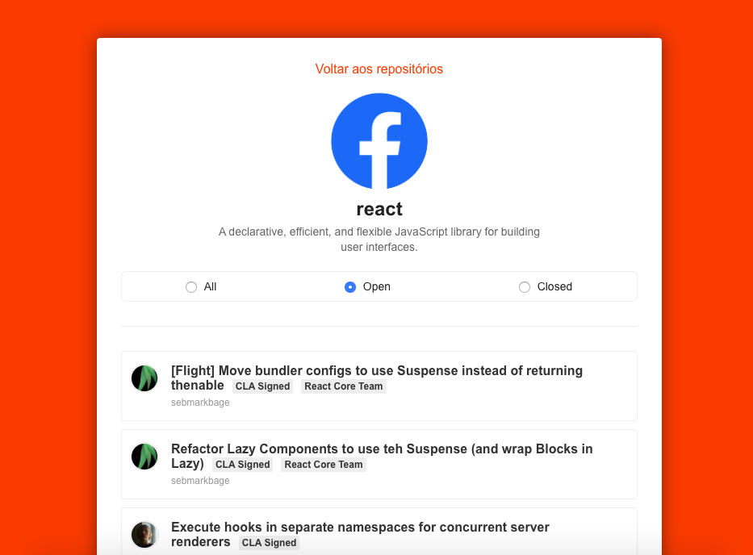

# github-api-reactjs

>Main

>Repository

## Motivation

During a Rocketseat course, this project is a oportunitty to learn more about ReactJS.

## Technologies

I use mainstream technologies to make a responsive layout for presentation a GitHub data.

- React
- React Router
- Styled Components
- React Icons
- Flex
- ESLint
- Prettier
- Axios
- PropTypes

## Contact

With you need to ask me anything, don`t worry. In my description there are my contacts.

Thanks !!!
